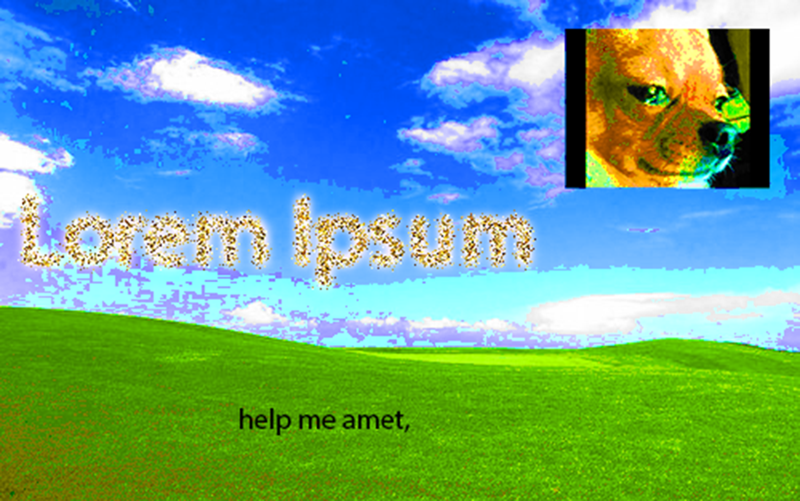

Hello! Welcome to my little internet hole <i class="fa-regular fa-face-smile-beam"></i> I aim to use this space to share my past projects, and put a little speck of me onto the vast expense of the world wide web <i class="fa-solid fa-water"></i> <i class="fa-solid fa-water"></i> <i class="fa-solid fa-water"></i> <i class="fa-solid fa-person-drowning"></i> <i class="fa-solid fa-water"></i> <i class="fa-solid fa-water"></i>

<br>

If you've been redirected from `<a href =`{=html}https://drive.google.com/drive/folders/1F0JPeF3S7A6dY621TJ5rCcIuw9SP7olN`>`{=html}this google drive link</a>, don't worry, you're in the right place! I've just been... *redecorating*. Or making it easier to scan through than a wall of files, at least.

You can find the exact same videos / graphics (and more!) in the "Videos" and "Graphics" tabs. Some are official projects done for school / work, while others are less polished, done more for my own enjoyment & exploration than anything else. While employment is on my mind when making this, I also want to have fun with this free URL (thank you github student plan), so I don't want to make this tooo formal tehee. Hopefully regardless of what I post here, it'll show my capabilities one way or another!

```{r}


```

```{=html}
<style>

body {

background-image: url("{{ background_url }}") }

.quarto-title-banner {
  margin-block-end: 1rem;
  position: relative;
  margin-top: -30px;
  height: 270px;
  background-image: url("{{ background_url }}");
  text-align: center;
}


</style>

<div class="dynamic-background">
  </div>
```

```{r startupcode, echo=FALSE, warning=FALSE, message=FALSE}
# will fix this one day sigh

#remove this or ur gonna get hacked lol
#Account Email: dawnc.sols@gmail.com
#Account ID: 37fe2910-d9ad-438e-a597-1581a1b2a40b

library(httr)
library(jsonlite)
library(rjson)
library(htmltools)
fontawesome::fa_html_dependency()


```

<br>

p.s. SPECIAL thank you to this guy and his lecture slides: [https://damien-dupre.github.io/BAA1028/lectures/lecture_1](https://damien-dupre.github.io/BAA1028/lectures/lecture_1#/title-slide)

He doesn't know me. But now I know him. Parasocially. Just stumbled upon the slides; really like the guy. Anyways. This is the most approachable and understandable guide on how to make & customise Quarto websites I could find. I was so close to giving up and re-starting from scratch with a trad. HTML / CSS / JS file structure but now I don't have to!!! Yippie everyone clap now

<br><br><br><br><br><br><br><br><br>

Scrolled this far? Here, have a fun button to press \>:)

<iframe width="110" height="200" src="https://www.myinstants.com/instant/dramatic-tiktok-63207/embed/" frameborder="1" scrolling="no">

</iframe>
